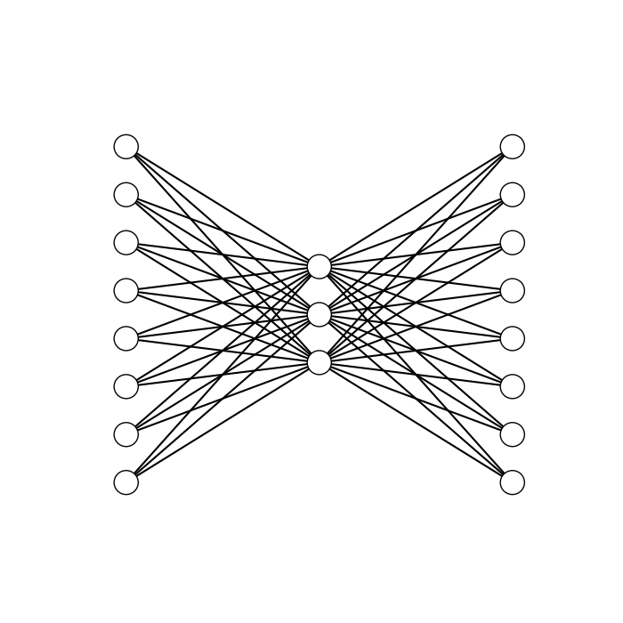
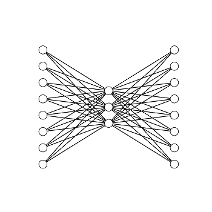

# Neural Network 838 Encoder Decoder
Modeling 8-bit binary input using 8-3-8 shaped neural network

## Decription
This code is to manulay construct a three layered neural network. The input layer has a size of 8, the hidden layer has a size of 3, and the output layer has a size of 8. The main goal is to map (encode and decode) an 8-bit binary signal from the input to the ouput.

**Figure 1.** The target function to be learned.

**Figure 2.** The neural network architecture.

The file 'neural_network_manual.py' is the manual implementation of the model and the file 'neural_network_keras.py' is the implementation using Keras library.
